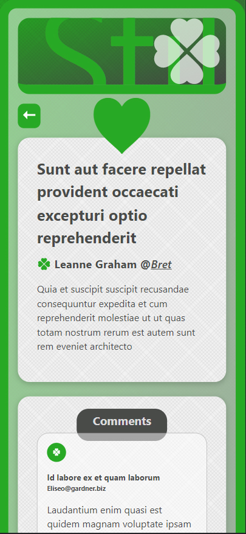

# SINGLE-PAGE BLOG APP

This is a solution for a Junior FE challenge implementing React.

### LIVE DEMO: [https://article-board-sage.vercel.app/](https://article-board-sage.vercel.app/)


### The challenge

Create a single-page app that will fetch data from several endpoints and showcase them in a "board".

#### Main Page

##### All articles contain:

- [x] Title (shortened)
- [x] Text (shortened)
- [x] Author's name -> called from another endpoint
- [x] Number of comments -> link to comment section
- [x] Read More -> link to the full post detail

#### Detail Page:

##### All articles contain:

- [x] Title
- [x] Author's name & username
- [x] Full text
- [x] **Comment section** contains:
  - [x] Title
  - [x] Author's email
  - [x] Text

##### More specification:

- [x] Every Detail Page can be accessed via "posts/{postID}" url

## My process

### Built with

- Semantic HTML5 markup, custom CSS & Typescript
- [React](https://reactjs.org/) 18 - JS library with [Vite](https://vitejs.dev/) build
- Additional deps: @tanstack/react-query, axios, react-router-dom

## How to install & run

First, run the development server:

```bash
npm install
npm run dev
# or
yarn install
yarn dev
```

### Screenshots

## Desktop version:


## Mobile version:



